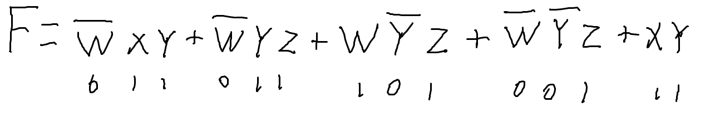
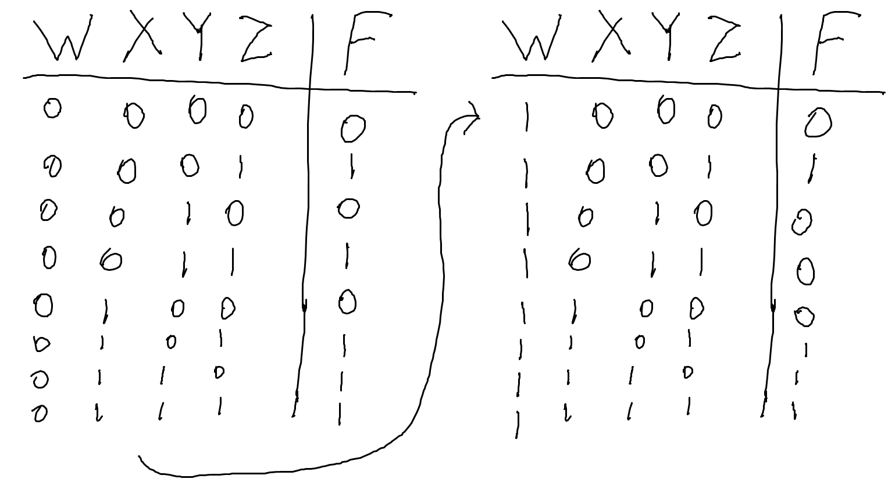
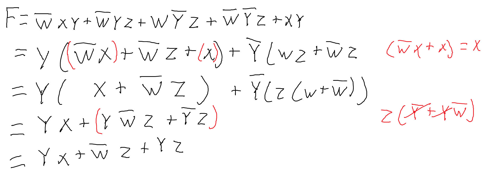
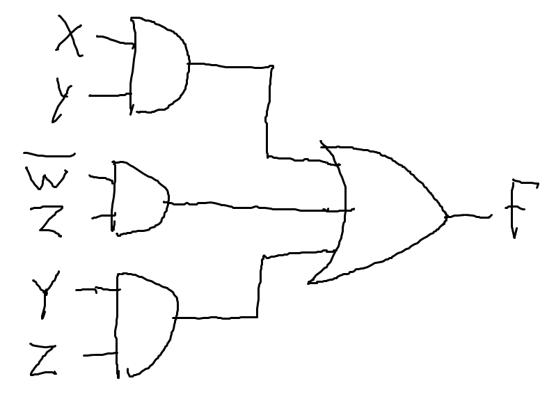
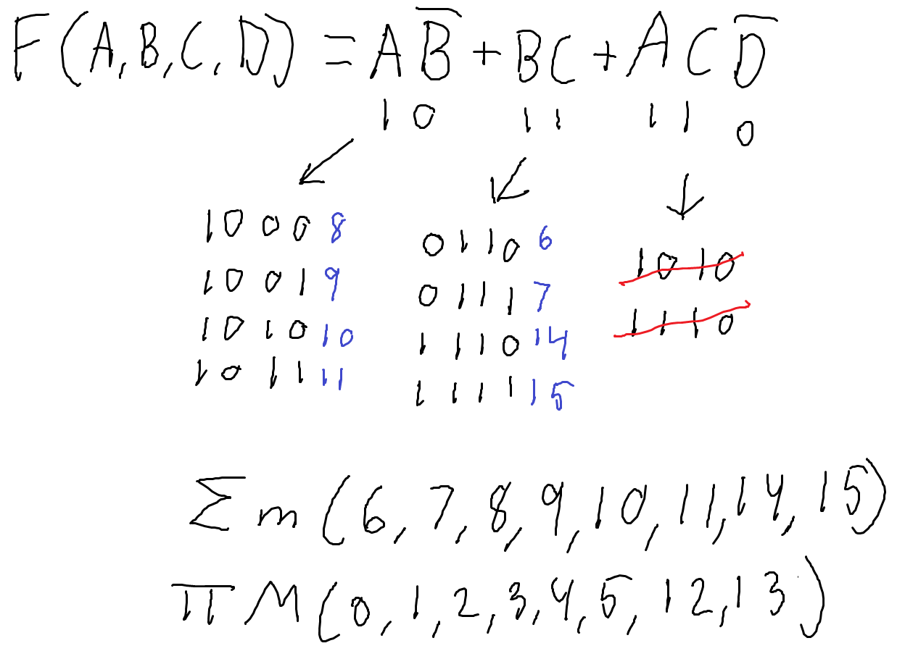
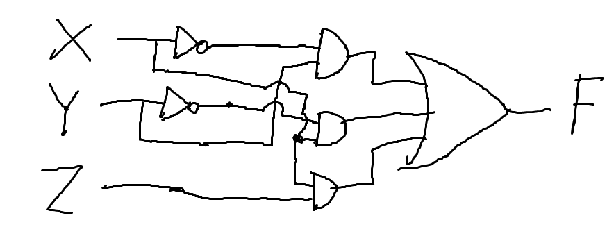
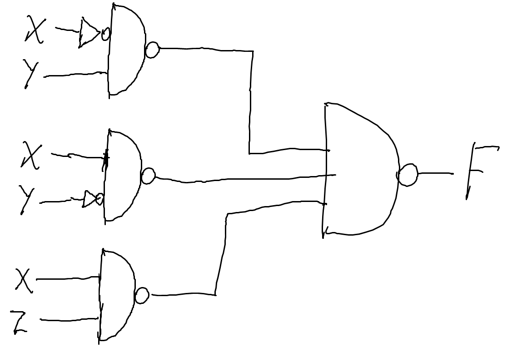
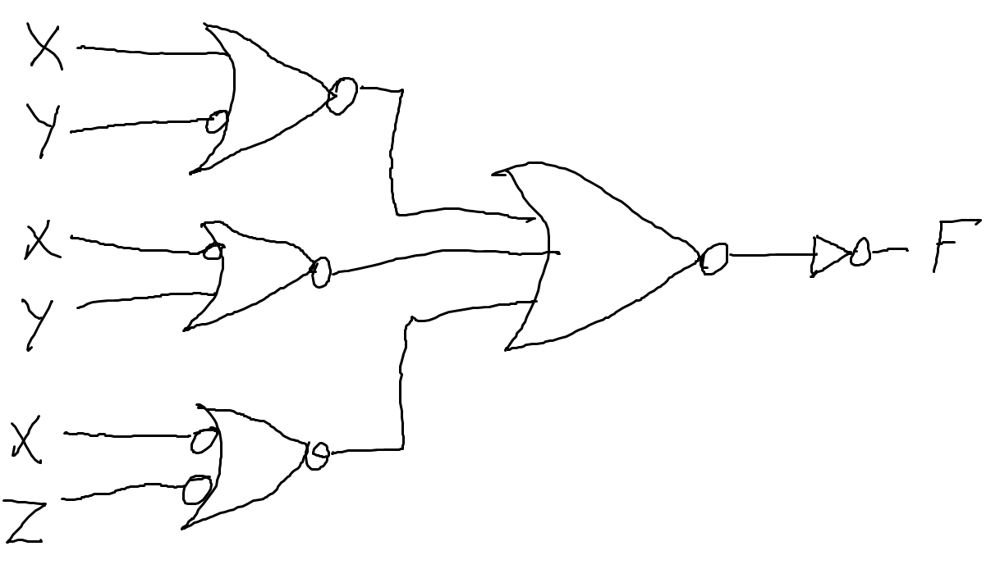

# Exercise 2
## 1.
### a.
$$
xyz + \bar{x}y + xy\bar{z} \\
y (xz + \bar{x} + x\bar{z}) \\
y (\bar{x} + x(z + \bar{z})) \\
y (\bar{x} + x(1)) \\
y (\bar{x} + x) \\
y 1 \\
\underline{\underline{y}}
$$

### b.
$$
\bar{x}yz + xz \\
z (\bar{x}y + x) \\
z ((x + \bar{x}) (x + y)) \\
z (x + y) \\
\underline{\underline{xz + yz}}
$$

### c.
$$
\overline{(x + y)} (\bar{x} + \bar{y}) \\
\bar{x} \bar{y} (\bar{x} + \bar{y}) \\
\bar{x} \bar{x} \bar{y} + \bar{x} \bar{y} \bar{y} \\
\bar{x} \bar{y} + \bar{x} \bar{y} \\
\underline{\underline{\bar{x} \bar{y}}} \\
$$

### d.
$$
xy + x (wz + w\bar{z}) \\
xy + x (w (z + \bar{z})) \\
xy + xw (1) \\
\underline{\underline{x (y + w)}}
$$

### e.
$$
(y\bar{z} + \bar{x}w) (x\bar{y} + z\bar{w}) \\

$$

### f.

## 2.
$$
F = \bar{w}xy + \bar{w}yz + w\bar{y}z + \bar{w}\bar{y}z + xy
$$

### a.

### b.

## 3.

## 4.
### a.

### b.

### c.
