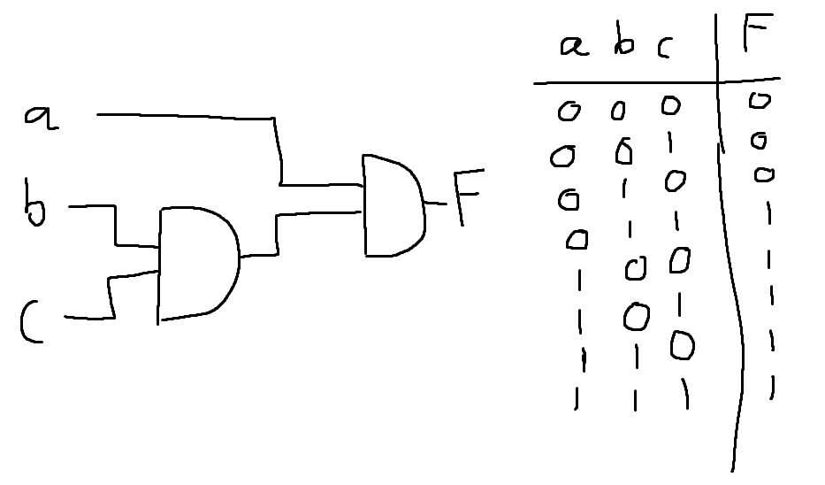
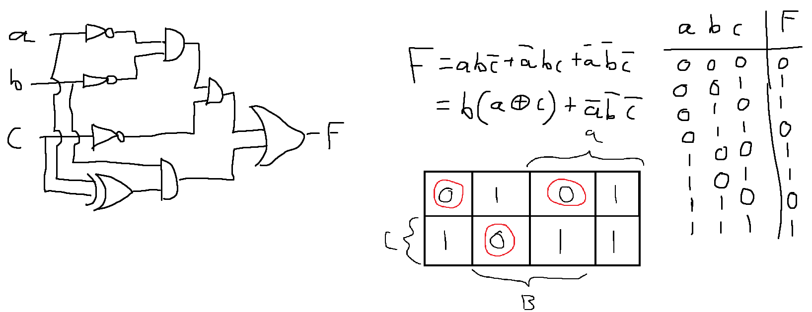
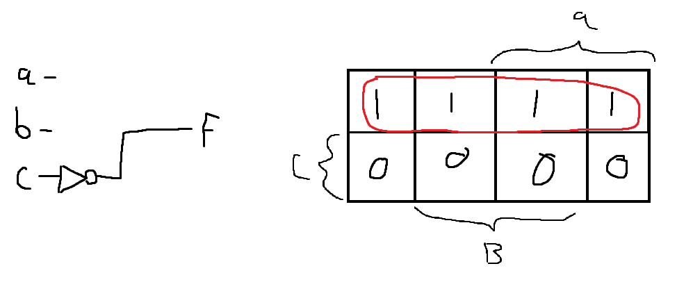
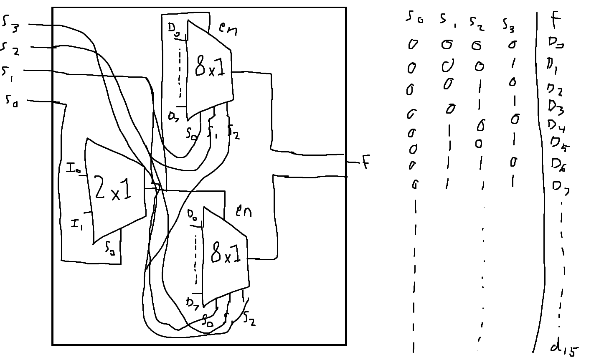
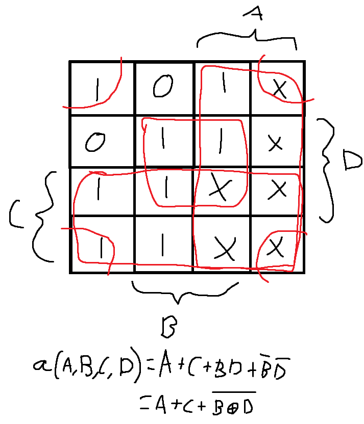

# Exercise 4
## 1. Design a combinational circuit with three inputs and one output:
### a. The output is 1 when the binary value of the inputs is more than 2. The output is 0 otherwise.

### b. The output is 1 when the binary value of the inputs is not divisable by 3.

### c. The output is 1 when the binary value of the inputs is an even number.

## 2. Design a combinational circuit that converts a four-bit Gray code to a four-bit binary number. Implement the circuit with exclusive-OR gates.

| g0  | g1  | g2  | g3  |     | b3  | b2  | b1  | b0  |
| --- | --- | --- | --- | --- | --- | --- | --- | --- |
| 0   | 0   | 0   | 0   |     | 0   | 0   | 0   | 0   |
| 0   | 0   | 0   | 1   |     | 0   | 0   | 0   | 1   |
| 0   | 0   | 1   | 0   |     | 0   | 0   | 1   | 1   |
| 0   | 0   | 1   | 1   |     | 0   | 0   | 1   | 0   |
| 0   | 1   | 0   | 0   |     | 0   | 1   | 1   | 1   |
| 0   | 1   | 0   | 1   |     | 0   | 1   | 1   | 0   |
| 0   | 1   | 1   | 0   |     | 0   | 1   | 0   | 0   |
| 0   | 1   | 1   | 1   |     | 0   | 1   | 0   | 1   |
| 1   | 0   | 0   | 0   |     | 1   | 1   | 1   | 1   |
| 1   | 0   | 0   | 1   |     | 1   | 1   | 1   | 0   |
| 1   | 0   | 1   | 0   |     | 1   | 1   | 0   | 0   |
| 1   | 0   | 1   | 1   |     | 1   | 1   | 0   | 1   |
| 1   | 1   | 0   | 0   |     | 1   | 0   | 0   | 0   |
| 1   | 1   | 0   | 1   |     | 1   | 0   | 0   | 1   |
| 1   | 1   | 1   | 0   |     | 1   | 0   | 1   | 1   |
| 1   | 1   | 1   | 1   |     | 1   | 0   | 1   | 0   |

Når man kigger på truth table, kan man se at b3 altid er lig g0 (dette følger også pattern senere antaget at b4 er 0).
Derefter følger det dette mønster:
* b2 = g1 xor b3
* b1 = g2 xor b2
* b0 = b3 xor b1
* 
![[Digital kredsløb exercise 4.2]]

## 3. Construct a 16 × 1 multiplexer with two 8 × 1 and one 2 × 1 multiplexers. Use block diagrams.

## 4.
Truth table:

| A | B | C | D |   | a | b | c | d | e | f | g |
|---|---|---|---|---|---|---|---|---|---|---|---|
| 0 | 0 | 0 | 0 |   | 1 | 1 | 1 | 1 | 1 | 1 | 0 |
| 0 | 0 | 0 | 1 |   | 0 | 1 | 1 | 0 | 0 | 0 | 0 |
| 0 | 0 | 1 | 0 |   | 1 | 1 | 0 | 1 | 1 | 0 | 1 |
| 0 | 0 | 1 | 1 |   | 1 | 1 | 1 | 1 | 0 | 0 | 1 |
| 0 | 1 | 0 | 0 |   | 0 | 1 | 1 | 0 | 0 | 1 | 1 |
| 0 | 1 | 0 | 1 |   | 1 | 0 | 1 | 1 | 0 | 1 | 1 |
| 0 | 1 | 1 | 0 |   | 1 | 0 | 1 | 1 | 1 | 1 | 1 |
| 0 | 1 | 1 | 1 |   | 1 | 1 | 1 | 0 | 0 | 0 | 0 |
| 1 | 0 | 0 | 0 |   | 1 | 1 | 1 | 1 | 1 | 1 | 1 |
| 1 | 0 | 0 | 1 |   | 1 | 1 | 1 | 1 | 0 | 1 | 1 |
| 1 | 0 | 1 | 0 |   | 0 | 0 | 0 | 0 | 0 | 0 | 0 |
| 1 | 0 | 1 | 1 |   | 0 | 0 | 0 | 0 | 0 | 0 | 0 |
| 1 | 1 | 0 | 0 |   | 0 | 0 | 0 | 0 | 0 | 0 | 0 |
| 1 | 1 | 0 | 1 |   | 0 | 0 | 0 | 0 | 0 | 0 | 0 |
| 1 | 1 | 1 | 0 |   | 0 | 0 | 0 | 0 | 0 | 0 | 0 |
| 1 | 1 | 1 | 1 |   | 0 | 0 | 0 | 0 | 0 | 0 | 0 |

Lav k-map for dem alle tror jeg:

a)

Gider ikke lave resten, men gætter på det er processen.