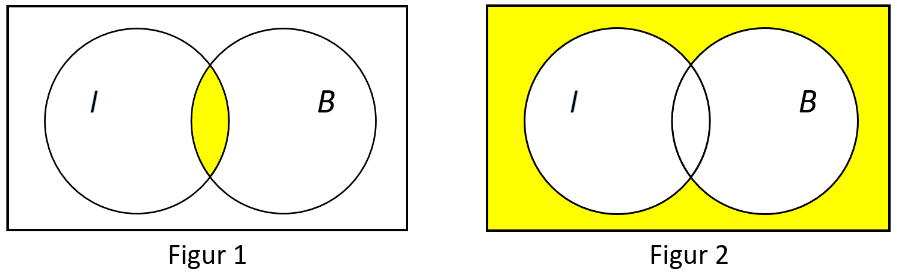

---
---
---

# Frivillig Afleveringsopgave

## Opgave 1 – Solcreme på tube

I en produktion fyldes der solcreme på små tuber. Erfaringsmæssigt er massen af en tube solcreme normalfordelt med en standardafvigelse på $\sigma = 2.8g$.

Som led i en kvalitetskontrol udtages der en tilfældig stikprøve på 9 tuber solcreme, som efterfølgende afvejes. De afvejede masser i gram (g), er vist i nedenstående tabel:

|       |       |       |       |       |       |       |       |       |
|-------|-------|-------|-------|-------|-------|-------|-------|-------|
| 168.6 | 171.4 | 166.1 | 170.5 | 170.9 | 167.2 | 164.1 | 169.6 | 168.1 |

### a. Bestem stikprøvens middelværdi og standardafvigelse.

Stikprøvens middelværdi og standardafvigelse findes vha. R funktionerne mean() og sd()

```{r}
D <- c(168.6, 171.4, 166.1, 170.5, 170.9, 167.2, 164.1, 169.6, 168.1)
Xbar <- mean(D)
S <- sd(D)
cat("Middelværdien af stikprøven er", Xbar, "\nog standardafvigelsen er", S)
```

### b. Bestem et 95% konfidensinterval for populations-middelværdien, $\mu$. Forklar kort med ord, hvad et 95% konfidensinterval for middelværdien beskriver.

For et 95% konfidensinterval skal man have en signifikansniveau $\alpha$ på 5%. Da standardafvigelsen kendes kan følgende konfidensinterval bruges:

$$
\bar{x} - z_{\alpha / 2} \cdot \frac{\sigma}{\sqrt{ n }} < \mu < \bar{x} + z_{\alpha / 2} \cdot \frac{\sigma}{\sqrt{ n }}
$$

Beregnes dette i R fås

```{r}
alpha = 0.05
sigma = 2.8
n = length(D)
z_alpha = qnorm(alpha/2, lower.tail = FALSE)
cat(Xbar - z_alpha * sigma / sqrt(n), "< 𝜇 <", Xbar + z_alpha * sigma / sqrt(n))
```

Et 95% konfidensinterval betyder at middelværdien vil ligge indenfor intervallet (her fra 166.7 til 170.3) med 95% sikkerhed. Det vil sige, at hvis man finder en stikprøve hvor dette ikke gælder vil det kun ske 5% af gangende, og at det da er statistisk usandsynligt.

### c. Bestem den mindste stikprøvestørrelse, der bevirker, at 95% konfidensintervallet har en intervalbredde på højst 2.0 g, dvs. at 95%-konfidensintervallet er: $\bar{y} \pm 1.0 \text{ g}$.

Hvis man vil have et konfidensinterval på 95% bliver signifikansniveauet $a$ igen 5%, hvilket betyder at samme kritiske region fra før kan bruges. Derefter den maksimale fejl $E$ sættes lig det ønskede intervalbredde. Følgende formel kan da bruges til at finde den mindste stikprøvestørrelse

$$
n = \left[ \frac{z_{\alpha / 2} \cdot \sigma}{E} \right]^{2}
$$

```{r}
E = 2.0
n = (z_alpha * sigma * E)^2
cat("Den mindste stikprøvestørrelse for det ønskede konfidensinterval og intervalbredde er:", n)
```

## Opgave 2 - Defekte og intakte ventiler

En virksomhed fremstiller ventiler på to maskiner, maskine A og maskine B. På en given dag fremstiller virksomheden i alt 700 ventiler, hvoraf maskine A fremstiller 70%. En tilfældig ventil betegnes med ***A*** eller ***B***, hvis den er fremstillet på hhv. maskine A og B.

For at en ventil skal kunne anvendes i den videre produktion, skal den være intakt. En intakt ventil betegnes ***I***. En ventil, som ikke kan anvendes, betegnes defekt (***D***), og ventilen kasseres. 4% af de fremstillede ventiler er defekte. Den pågældende dag var 199 af ventilerne fra maskine B intakte.

### a. Udfyld fordelingen af antal ventiler i en tabel som nedenstående, idet nødvendige mellemregninger medtages.

Det vides i starten at 70% af 700 ventiler svarende til 490 ventiler er fra maskine A. Ud af de fremstillede ventiler vides det også at 4% er defekte, hvilket svarer til 28 ventiler. Til sidst vides det at maskine B havde 199 intakte ventiler.

Med denne information kan man først finde ud af mængden af ventiler fra maskine B i alt som differensen af antal ventiler i alt og fra maskine A

$$
n(B) = 700 - 490 = 210
$$

Differensen af dette og antallet af intake ventiler fra maskine B må da være antal defekte ventiler fra maskinen

$$
n(I | B) = 210 - 199 = 11
$$

Det kan også udregnes at differensen af det totalte antal ventiler og antallet af defekte må være antallet af intakte ventiler

$$
n(I) = 700 - 28 = 672
$$

Antallet af intakte og defekte ventiler fra maskine A kan da beregnes som antallet af intakte og defekte i alt fraregnet dem fra maskine B

$$
n(I) = 672 - 199 = 473
$$

$$
n(D | A) = 18 - 11 = 17
$$

|                    |           |           |       |
|--------------------|-----------|-----------|-------|
|                    | Maskine A | Maskine B | I alt |
| Intakt ventil, *I* | 473       | 199       | 672   |
| Defekt ventil, *D* | 17        | 11        | 28    |
| I alt              | 490       | 210       | 700   |

### b. En tilfældig blandt de fremstillede ventiler udtages. Beregn sandsynligheden for følgende:

-   Ventilen er fremstillet på maskine B, $P(B)$

-   Ventilen er intakt, $P(I)$

-   Ventilen er defekt, $P(D)$

-   Ventilen er fremstillet på maskine B og er defekt, $P(D \cap B)$

-   Ventilen er intakt, når den er fremstillet på maskine A, $P(I | A)$

-   Ventilen er defekt, når den er fremstillet på maskine B, $P(D | B)$

Det antages, at vi har at gøre med en simpel sandsynlighed, så sandsynligheden kan findes som antal gunstige over antal mulige.

$$
P(B) = \frac{n(B)}{n(\text{I alt})} = \frac{210}{700} = 0.3
$$

$$
P(I) = \frac{n(I)}{n(\text{I alt})} = \frac{672}{700} = 0.96
$$

$$
P(D) = \frac{n(D)}{n(\text{I alt})} = \frac{28}{700} = 0.04
$$

$$
P(D \cap B) = \frac{n(D \cap B)}{n(\text{I alt})} = \frac{11}{700} \approx 0.0157
$$

$$
P(I|A) = \frac{n(I | A)}{n(\text{I alt} | A)} = \frac{473}{490} \approx 0.965
$$

$$
P(D|B) = \frac{n(D | B)}{n(\text{I alt} | B)} = \frac{11}{210} \approx 0.0524
$$

### c. I figur 1 og i figur 2 ses et Venn-diagram med hvide og gule områder.

### 

-   Beskriv med ord, hvilke ventiler det gule område svarer til i figur 1.

-   Hvilken eller hvilke af følgende hændelser svarer det gule område til i figur 2:

    1.  $(I \cap B)^{c}$
    2.  $(I \cup B)^{c}$
    3.  $I^{c} \cap B$
    4.  $I^{c} \cap B^{c}$
    5.  $I^{c} \cup B^{c} \cup (I \cap B)$

Det gule område i figur 1 svarer til ventilerne som både er intakte og produceret af maksine B (dem som der er 199 af).

Det gule område i figur 2 svarer til hændelserne 2 og 4.

## Opgave 3 - Solcellers effekt

En virksomhed producerer solceller. Varedeklarationen for virksomhedens solceller angiver, at en solcellernes middeleffekt er på 100W (watt) i klart solskinsvejr.

Virksomheden ønsker at undersøge, om specifikationerne overholdes.

Der udtages derfor en tilfældig stikprøve på 32 solceller, som testes i en teststander, der simulerer klart solskinsvejr. Nedenstående tabel viser de målte effekter i W:

|       |       |       |       |       |       |       |       |
|-------|-------|-------|-------|-------|-------|-------|-------|
| 105.4 | 91.9  | 100.3 | 103.9 | 104.4 | 100.5 | 93.8  | 102.9 |
| 94.2  | 101.2 | 100.2 | 103.3 | 97.7  | 98.6  | 96.5  | 101.1 |
| 107.5 | 100.2 | 96.7  | 105.8 | 99.2  | 90.8  | 101.2 | 100.6 |
| 106.6 | 96.9  | 97.1  | 98.1  | 100.4 | 103.1 | 99.2  | 108.3 |

Virksomheden ønsker at undersøge ved hjælp af en hypotesetest, om middelværdien af effekten for de fremstillede solceller opnår den ønskede værdi på mindst 100W, når der vælges et signifikansniveau på 5%.

### a. Opstil nulhypotese og alternativhypotese for denne hypotesetest.

Da virksomheden gerne vil have at middeleffekten på 100W overholdes, vil nulhypotesen være at middelværdien er 100W, hvilket betyder at alternativhypotesen er at middelværdien ikke er 100W. Dette kan matematisk opstilles som:

$$
H_{0}: \mu = 100, \qquad H_{1} \neq 100
$$

### b. Opstil formlen for teststørrelsen og beregn dens værdi. Angiv hvilken fordeling den følger.

Da der er mindst 30 målinger kan teststørrelsen modeleres efter en normalfordeling. Da der tales som en test med 2 haler uden at kende standard afvigelsen vil formlen for teststørrelsen da være

$$
Z = \frac{\bar{X} - \mu_{0}}{S / \sqrt{n}}
$$

Indsættes værdierne for de forskellige størrelser i R fås følgende

```{r}
D = c(105.4, 91.9, 100.3, 103.9, 104.4, 100.5, 93.8, 102.9, 94.2, 101.2, 
      100.2, 103.3, 97.7, 98.6, 96.5, 101.1, 108.5, 100.2, 96.7, 105.8, 99.2, 
      90.8, 101.2, 100.6, 106.6, 96.9, 97.1, 98.1, 100.4, 103.1, 99.2, 108.3)
Xbar = mean(D)
mu0 = 100
S = sd(D)
n = 32
Z = (Xbar - mu0) / (S / sqrt(n))
cat("Værdien for teststørrelsen bliver", Z)
```

### c. Beregn den kritiske region for testen og konkludér på hypotesetesten.

Da middelværdien ikke må blive for lav eller høj har vi med en to-halet test at gøre, hvilket betyder at de kritiske regioner vil være $-z_{\alpha / 2}$ og $z_{\alpha / 2}$. Disse kan da findes og sættes op imod nulhypotesen.

```{r}
alpha = 0.05
z_alpha = qnorm(alpha/2, lower.tail = FALSE)
cat(-z_alpha, "<", Z, "<", z_alpha)
```

Da nulhypotesen passer må den verificeres, hvilket må betyde at solcellernes ønskede effekt bliver produceret indenfor et konfidensinterval på 95%.

### d. Hvilke antagelser er der foretaget for at udføre hypotesetesten? Er antagelserne rimelige?

Der antages at stikprøven er repræsentativt for alle solceller i virksomheden. Da stikprøven er udtaget tilfældigt må man bare stole på at antagelsen er rimelig, så længe der ikke er noget problem med metoden brugt til at finde en tilfældig stikprøve.
