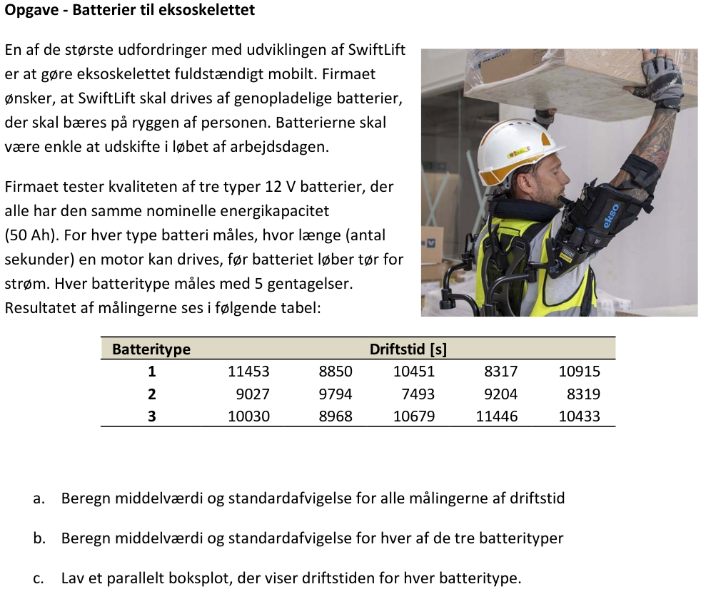
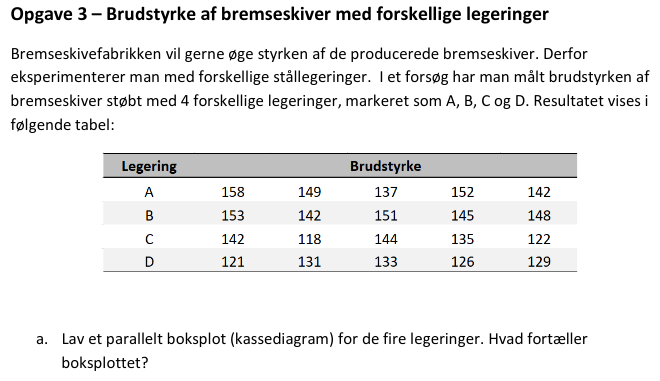
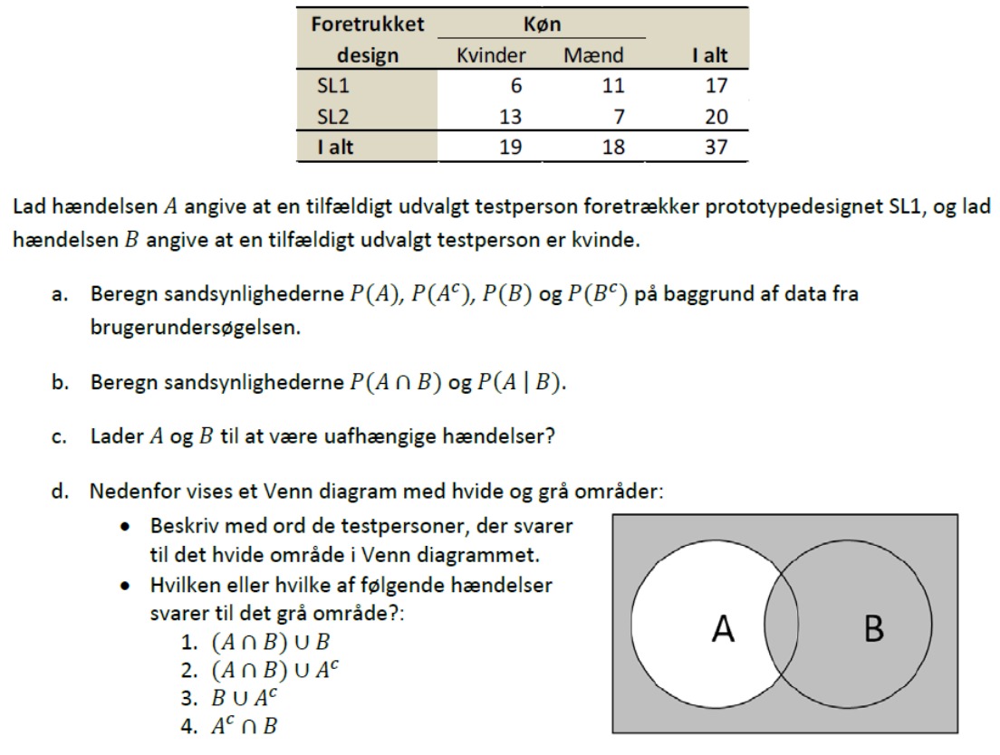
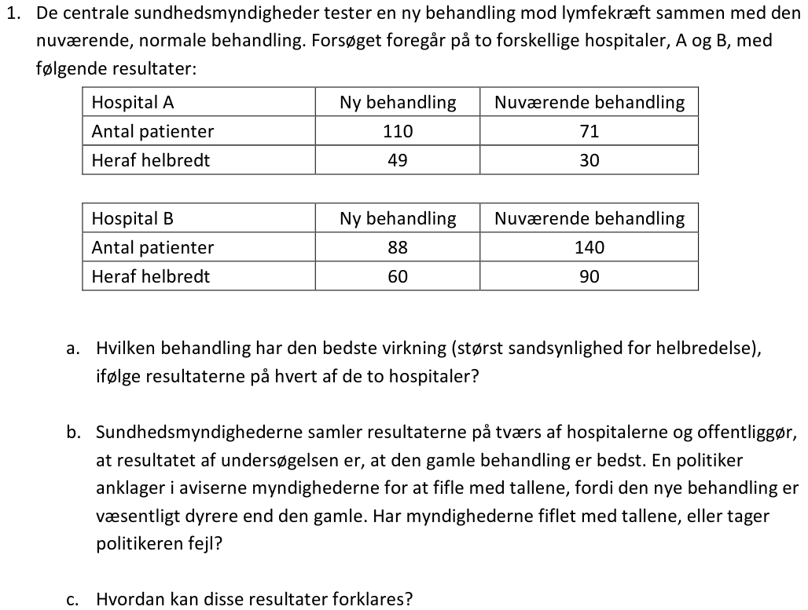

# Week 2

## Opgave - Batterier til eksoskelette



### a.

```{r}
D <- read.csv("eksoskelet_batterier.csv", TRUE, ";")
batteritype = D$Batteritype
driftstid = D$Driftstid

cat("Middelværdien og standardavigelsen af alle målinger er hhv:", mean(driftstid), "og", sd(driftstid), "\n")
```

### b.

```{r}
result <- aggregate(driftstid ~ batteritype, D, function(x) c(Gennemsnit = mean(x), Standardafvigelse = sd(x)))
do.call(data.frame, result)
```

### c.

```{r}
boxplot(driftstid ~ batteritype, main = "Driftstid for forskellige batterityper", xlab = "Driftstid (s)", ylab = "batteritype", horizontal = TRUE)
```

## **Eksamensopgave** 2021 3a



```{r}
D <- read.csv("Data_ECEStat_2021_opg3.csv", TRUE, ";")
legering = D$Opg3_Legering_navn
brudstyrke = D$Opg3_Styrke

boxplot(brudstyrke ~ legering, main = "Brudstyrker for forskellige legeringer", xlab = "Legetingstype", ylab = "styrke")
```

## Opgave om design af et eksoskelet



### a.

```{r}
K = c(6, 13, 19)
M = c(11, 7, 18)
D <- data.frame (
  design = c("SL1", "SL2", "I alt"),
  Kvinder = K,
  Mænd = M,
  IAlt = K+M
)

A = D$IAlt[1]
Ac = D$IAlt[2]
B = D$Kvinder[3]
Bc = D$Mænd[3]

PA = A / D$IAlt[3]
PAc = Ac / D$IAlt[3]
PB = B / D$IAlt[3]
PBc = Bc / D$IAlt[3]

cat("Sandsynlighederne bliver \n",
    "P(A) =", PA, "\n",
    "P(A^{c}) =", PAc, "\n",
    "P(B) =", PB, "\n",
    "P(B^{c}) =", PBc)

```

### b.

```{r}
# fællesmængden svarer til kvinder der foretrækker sl1
PAnB = D$Kvinder[1] / D$IAlt[3]

# Den multiplikative lov bruges
PAIB = PAnB / PB

cat("Sandsynlighederne bliver \n",
    "P(AnB) =", PAnB, "\n",
    "P(A|B) =", PAIB)
```

### c.

Dette udtryk burde at være sandt hvis A og B er uafhængige

```{r}
PAnB == PA * PB
```

Da det ikke er sandt må A og B er afhængige.

### d.

Det hvide område må være mænd som foretrækker sl1, da fællesmængden er kvinder som foretrækker sl1 og resten af B svarer til alle kvinder.

Både 2. og 3. kan beskrive det grå område.

## Opgaver til lektion om sandsynlighedsregning

### 1.



#### a.

```{r}
HA <- data.frame (
  Kategori = c("Antal patienter", "Heraf helbredt"),
  NyBehandling = c(110, 49),
  NuværendeBehandling = c(71, 30)
)

HB <- data.frame (
  Kategori = c("Antal patienter", "Heraf helbredt"),
  NyBehandling = c(88, 60),
  NuværendeBehandling = c(140, 90)
)

PAny = HA$NyBehandling[2] / HA$NyBehandling[1]
PAgammel = HA$NuværendeBehandling[2] / HA$NuværendeBehandling[1]
PBny = HB$NyBehandling[2] / HB$NyBehandling[1]
PBgammel = HB$NuværendeBehandling[2] / HB$NuværendeBehandling[1]

cat(PAny, PAgammel, PBny, PBgammel)
```

Behandlingen med størst sandsynlighed i alt er den nye i hospital B. Den som er bedst for hospital A er også den nye.

#### b.

Sundhedsmyndighederne har nok fiflet lidt med tallene, siden at de nye behandlinger rent statistisk set er bedre.

#### c.

Resultaterne skyldes muligvis at alle behandlinger i hospital B er bedre, men at den gamle behandling er meget grundigere afprøvet med en halv gange flere patienter i stikprøven.
